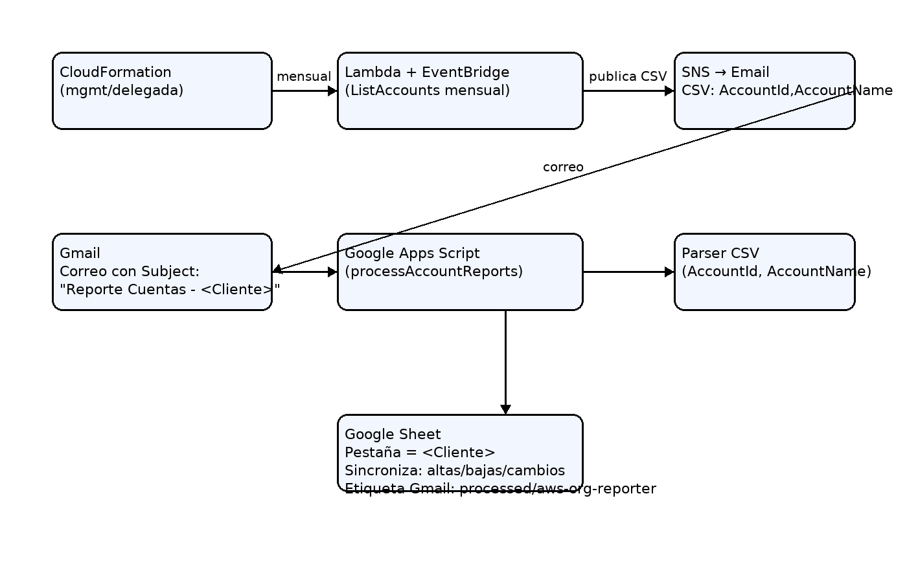

# AWS Org → Gmail → Google Sheets Reporter

Automatiza el envío mensual (AWS) y la consolidación en Google Sheets (Apps Script) de **AccountId + AccountName** de todas las cuentas en tu AWS Organization.

- **AWS (CloudFormation)**: Lambda + EventBridge + SNS que envía un CSV por correo con `AccountId,AccountName` el **primer lunes de cada mes**. El asunto es `Reporte Cuentas - <Cliente>`.
- **Google Apps Script**: Lee Gmail, crea/actualiza una **pestaña por cliente** en un Google Sheet maestro y **sincroniza** (altas, bajas y cambios). Etiqueta los hilos procesados para no re-leerlos.



> También puedes ver el diagrama en Mermaid (renderable directamente en GitHub):

```mermaid
flowchart TD
    A[CloudFormation (mgmt/delegada)] -->|EventBridge mensual| B[Lambda: ListAccounts]
    B --> C[SNS: email CSV (AccountId,AccountName)]
    C --> D[Gmail: correo
Asunto: "Reporte Cuentas - <Cliente>"]
    D --> E[Apps Script: proceso]
    E --> F[Parsear CSV]
    F --> G[Google Sheet: pestaña = Cliente
Sincroniza: altas/bajas/cambios]
    G --> H[Gmail etiqueta processed/aws-org-reporter]
```

---

## Estructura del repo

```
.
├── docs/
│   └── diagram.png
├── google_script/
│   └── google_script.gs
├── templates/
│   └── cloudformation-org-reporter.yaml
├── .gitignore
└── README.md
```

---

## 1) Despliegue en AWS (CloudFormation)

Archivo: [`templates/cloudformation-org-reporter.yaml`](./templates/cloudformation-org-reporter.yaml)

**Parámetros**:
- `EmailRecipient` (String): correo destino (SNS e-mail subscription)
- `ClientName` (String): nombre que aparecerá en el subject (`Reporte Cuentas - <Cliente>`)
- `ScheduleExpression` (String, default `cron(0 12 ? * 2#1 *)`): primer lunes de cada mes, 12:00 UTC

**Pasos**:
1. Crea el stack en la **Management Account** (o cuenta con permisos completos de Organizations).
2. Confirma la **suscripción SNS** enviada al correo.
3. (Opcional) Invoca la **Lambda** manualmente para probar el envío.

---

## 2) Google Apps Script

Archivo: [`google_script/google_script.gs`](./google_script/google_script.gs)

**Configuración**:
- Abre tu **Google Sheet maestro** y ve a **Extensiones → Apps Script**.
- Copia el contenido de `google_script.gs` y **reemplaza** `SPREADSHEET_ID`.
- Ejecuta `processLatestForDebug()` para **autorizar** Gmail/Sheets.
- Desde el menú **AWS Reporter** (aparece en el Sheet): crea el trigger mensual (**segundo lunes**) con `Crear trigger (2º lunes/mes 09:00)`.

**Qué hace**:
- Busca correos con subject `Reporte Cuentas - <Cliente>`.
- Parsea CSV del cuerpo (`AccountId,AccountName`).
- Crea/actualiza pestaña con el **nombre del cliente**.
- Sincroniza (altas, bajas, cambios) y etiqueta hilos procesados con `processed/aws-org-reporter`.

---

## 3) Seguridad y mínimos privilegios

- **Lambda IAM**: logs + `organizations:ListAccounts` + `sns:Publish` (solo al tópico del stack).
- **SNS**: e-mail subscription (confirmación manual).
- **Apps Script**: permisos para Gmail y Sheets del usuario que lo ejecuta.

---

## 4) Troubleshooting rápido

- **No llega el correo**: confirma la suscripción del SNS y revisa el **Subject** exacto.
- **Sheet no se actualiza**: verifica `SPREADSHEET_ID` y ejecuta `processLatestForDebug()` para ver logs.
- **No se ejecuta automático**: asegúrate de crear el trigger (`createDailyTriggerForSecondWeek`) y que `scheduledRunner` esté en Triggers.

---

## Licencia

Uso interno. Ajusta a la política de tu organización.
